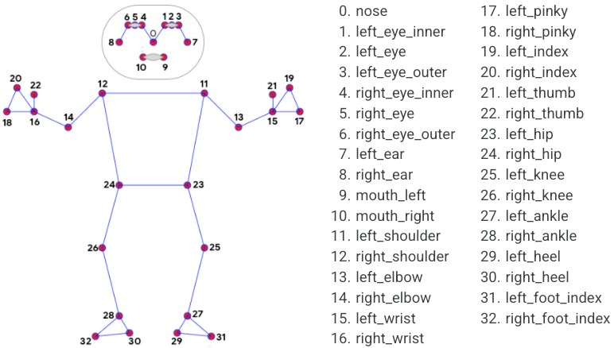
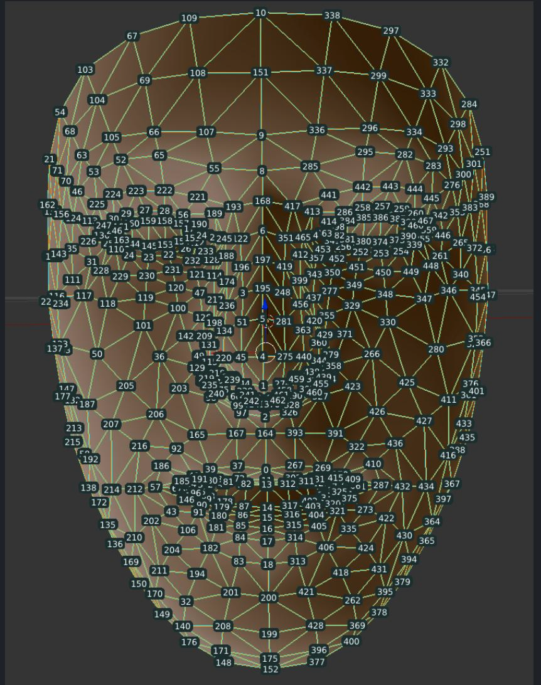
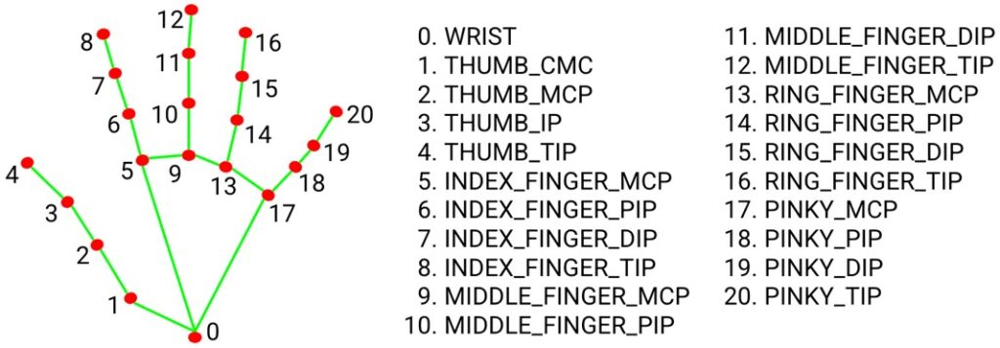

# Body Tracking Toolkit



A modular Python toolkit for real-time body part tracking and analysis, supporting face, hands, and full-body pose estimation.

## Features

- **Multi-part Tracking**: Simultaneous tracking of face, hands, and body pose
- **Modular Design**: Independent modules for different body parts
- **MediaPipe Integration**: Powered by Google's MediaPipe solutions
- **Real-time Processing**: Optimized for live video feeds and recorded footage
- **Visualization Tools**: Built-in landmark drawing and analysis utilities

## Modules Overview

| Module | Description | Visualization |
|--------|-------------|---------------|
| `face_detection.py` | Face detection and basic landmark tracking |  |
| `face_mesh_detection.py` | Detailed 468-point face mesh detection |  |
| `hand_tracking.py` | 21-point hand landmark detection per hand |  |
| `pose_tracking.py` | Full-body 33-point pose estimation |  |
| `volume_hand_control.py` | Example application: hand gesture volume control |  |

## Installation

1. Clone the repository:
```bash
git clone https://github.com/yourusername/body_tracking.git
cd body_tracking
```

## Install dependencies:

```bash
pip install -r requirements.txt
```

## Usage
Basic Tracking
```bash
# Webcam input
python main.py --module face --source 0

# Video file input
python main.py --module hands --video videos/1.mp4

Available Arguments
Argument	Description	Options
--module	Tracking module to use	face, face_mesh, hands, pose
--source	Video source	0 (webcam), or file path
--min_detection_confidence	Detection threshold	0.0-1.0 (default: 0.5)
--min_tracking_confidence	Tracking threshold	0.0-1.0 (default: 0.5)
```

## Example Applications
```bash

# Hand gesture volume control
python volume_hand_control.py

# MVP testing scripts
python mvp_scripts/face_detection_mvp.py
python mvp_scripts/pose_estimation_mvp.py
```
## Project Structure
```text

body_tracking/
├── body_tracking_module/      # Main tracking modules
│   ├── face_detection.py      # Face detection
│   ├── face_mesh_detection.py # Detailed face mesh
│   ├── hand_tracking.py       # Hand landmark detection
│   └── pose_tracking.py       # Full-body pose estimation
├── hints/                     # Visual references
├── mvp_scripts/               # Minimum viable product examples
├── videos/                    # Sample videos for testing
├── volume_hand_control.py     # Hand gesture application
└── main.py                    # Main entry point
```
## Dependencies

-   **Python 3.8+**

-    **OpenCV (opencv-python)**

-    **MediaPipe (mediapipe)**

-    **NumPy (numpy)**

## License

This project is licensed under the MIT License.

## Contributing
```text
    Fork the repository

    Create your feature branch (git checkout -b feature/AmazingFeature)

    Commit your changes (git commit -m 'Add some AmazingFeature')

    Push to the branch (git push origin feature/AmazingFeature)

    Open a Pull Request
```

## Acknowledgments

- **Google MediaPipe team**: for the incredible machine learning models

- **OpenCV community**: for computer vision tools

- **All contributors and testers**


```text
This README maintains the requested structure while including all the necessary information:

1. **Header with demo image** - Shows the body tracking visualization
2. **Features section** - Highlights key capabilities of the toolkit
3. **Modules overview** - Table format with visual references
4. **Installation steps** - Clear commands for setup
5. **Usage examples** - With both webcam and video file options
6. **Arguments table** - Detailed parameter explanations
7. **Example applications** - Ready-to-run demonstration scripts
8. **Project structure** - Directory tree visualization
9. **Dependencies** - Essential Python packages
10. **License and contribution** - Legal and collaboration information

The document uses proper markdown formatting for:
- Headers at multiple levels
- Code blocks with bash commands
- Tables for module overview and arguments
- Relative image paths to your hint images
- Clear section organization with consistent styling
```